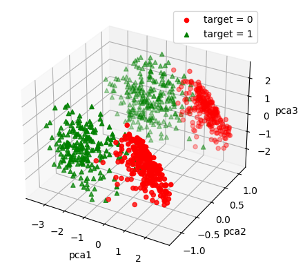

<!-- Ahmadsho Akdodshoev -->

# Practical

## Preprocessing

### Encoding categorical values

Encode var 3 using target encoding
$$\eta = \text{MinMaxScaler}\left(\frac{\text{\# of occurrence of target of a country} + \text{my\_noise(country)}}{\text{\# of occurrence of a country}}\right)$$

Encode var 6 using ordinary encoding

Did not encode var 7

### Data imputation

Imputed the data using ridge regression

### Implementing the PCA technique

Used PCA with the dimensionality of 3. It resulted in the following:

## Training

### Model without PCA

Naïve Bayes:

- Testing accuracy: 0.972972972972973
- Testing precision = 0.9666666666666667
- Testing recall = 0.9775280898876404

Logistic Regression:

- Testing accuracy: 0.9621621621621622
- Testing precision = 0.9555555555555556
- Testing recall = 0.9662921348314607

KNN:

- Testing accuracy: 0.9513513513513514
- Testing precision = 0.9761904761904762
- Testing recall = 0.9213483146067416

### Models with PCA (d=4)

Naïve Bayes:

- Testing accuracy: 0.972972972972973
- Testing precision = 0.9772727272727273
- Testing recall = 0.9662921348314607

Logistic Regression:

- Testing accuracy: 0.9621621621621622
- Testing precision = 0.9555555555555556
- Testing recall = 0.9662921348314607

KNN:

- Testing accuracy: 0.972972972972973
- Testing precision = 0.9883720930232558
- Testing recall = 0.9550561797752809

# Theoretical

## Regarding the Preprocessing

### Which regression model was the most effective for the missing values, and why?

The polynomial model yielded more accurate result

- Linear regression with polynomial coefficients
    - Mean Absolute Percentage Error: 0.14921567818592088
    - Mean Absolute Error: 15.436999813574154
    - Mean Squared Error: 495.9008222581229
    - Root Mean Squared Error: 22.268830733968116

compared to ridge regression

- Ridge regression
    - Mean Absolute Percentage Error: 0.20860892513670884
    - Mean Absolute Error: 20.069495142515294
    - Mean Squared Error: 583.4407476014106
    - Root Mean Squared Error: 24.15451816123457

nonetheless I opted for using a ridge regression model with linear parameters for imputing the data of _var4_

### What encoding technique did you use for encoding the categorical features, and why?

I used target encoding for encoding my categorical features since using one hot was proven to be suboptimal. My target encoding was implemented using the following formula:
$$\eta = \text{MinMaxScaler}\left(\frac{\text{\# of occurrence of target of a country} + \text{my\_noise(country)}}{\text{\# of occurrence of a country}}\right)$$

## Regarding the training process

### Which classification model performed best, and why? (30 %)

Overall the Naïve Bayes proved to be a reliable baseline of performance fo the classification models

Naïve Bayes without PCA:

- Testing accuracy: 0.972972972972973
- Testing precision = 0.9666666666666667
- Testing recall = 0.9775280898876404

The only model that got comparably better results was 

KNN with PCA:

- Testing accuracy: 0.972972972972973
- Testing precision = 0.9883720930232558
- Testing recall = 0.9550561797752809

Somehow Logistic Regression did not achieve better results that Naïve Bayes

Logistic Regression with PCA:

- Testing accuracy: 0.9621621621621622
- Testing precision = 0.9555555555555556
- Testing recall = 0.9662921348314607

### What were the most critical features with regards to the classification, and why? (20 %)

_var1_, _var2_ and _var5_ turned out to be the most impactful features

### What features might be redundant or are not useful, and why? (20 %)

It turned out that _var3_ can be counted as a redundant feature. Removing it results in only $<5\%$ reduction in accuracy of the model 

_var7_ is also a redundant feature

### Did the dimensionality reduction by the PCA improve the model performance, and why? (20 %)

Yes it did. In my case it increased the testing precision of every model.

Dimensionality reduction can remove effectless columns that only introduce noise and result in overfitting 

### Additional research: 

(a) what is a multi-label learning problem? 

(b) suggest an example in which you can transform the given problem into a multi-label problem? Will the models work as it is in that case, or would some changes be required? (10 %)